# StudentPortal
StudentPortal a dynamic website
## MVC using Servlet | JSP | JDBC | Maven

## List of Software with version-
* Windows - 10
* Eclipse Photon
* Java - 1.8
* Junit - 3.8.1
* Jstl - 1.2
* commons-fileupload - 1.4
* ojdbc6
* Oracle - 11.2.0
* Apache Tomcat - 9.0
* Javascript 
* Bootstrap4
## Description
* All pages have <strong>a navbar</strong>  in which <strong>Home, About, Activity dropbox, Profile, Login, Register, and Logout</strong> available. 
The active button shows your present sight. Activity dropbox contents <strong>Videos, Tasks, Upload, and Clock</strong> buttons.
* The <strong>home page</strong> has sliding pictures in which describe the content and Copywrite in the footer.
* It has an <strong>about page</strong> to describe the StudentPortal.
* After Register, you can Login and after Login, you can access Profile, Videos, Tasks, Upload pages. 
* It has <strong>the prevention of the back button after Logout.</strong>
* You can <strong>upload files on the server side using the upload page.</strong>
* It has also a Clock page to show time and date.

  
Student Portal

  
View

  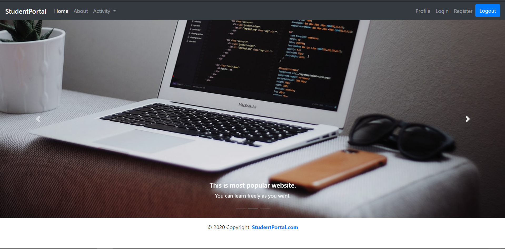
  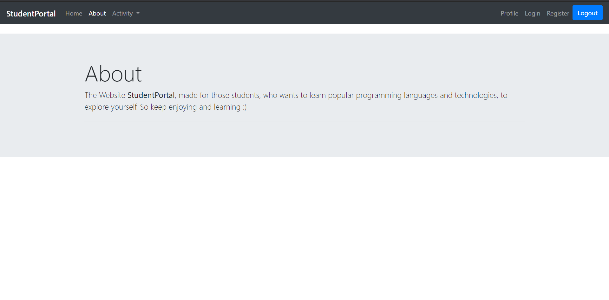
  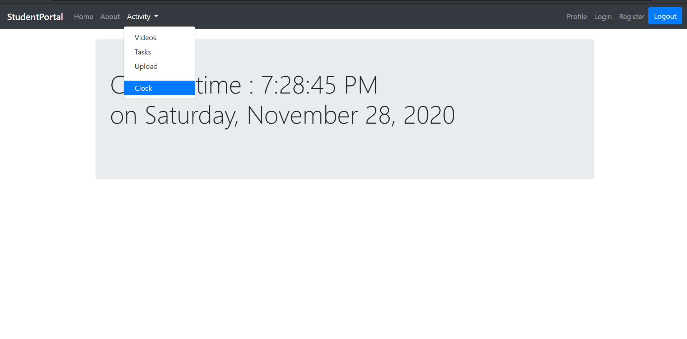
  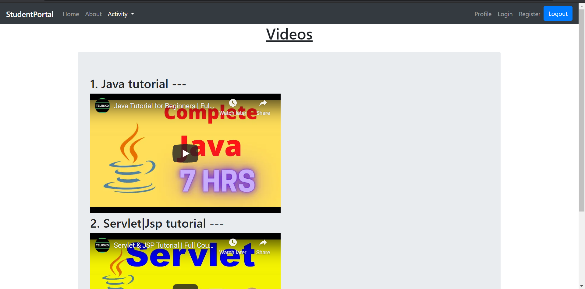
  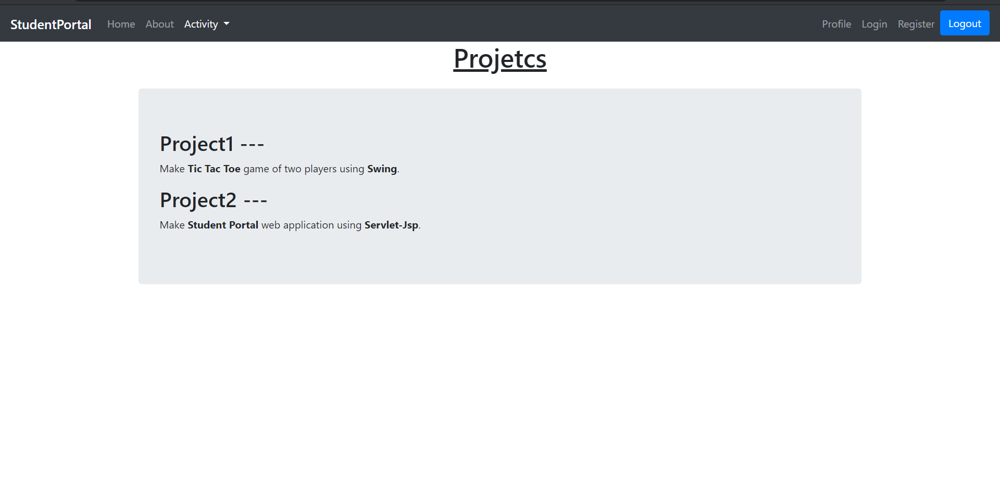
  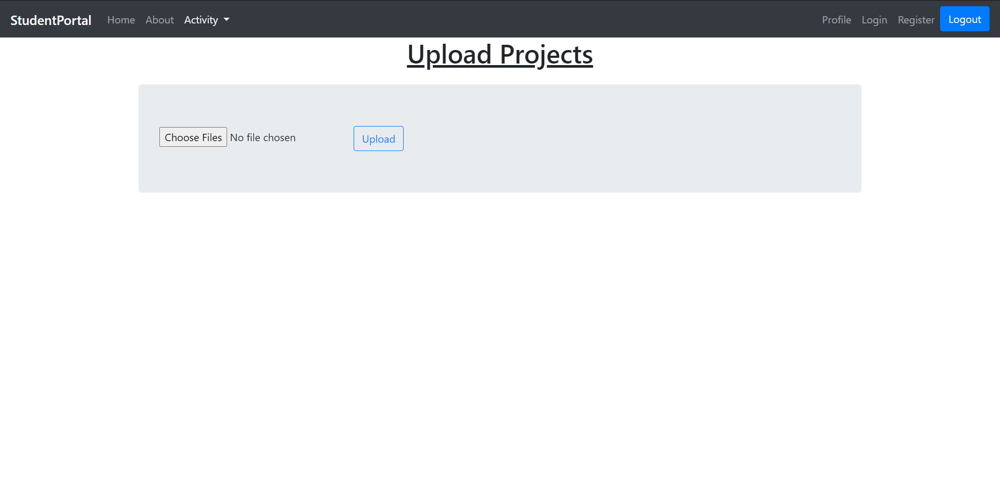
  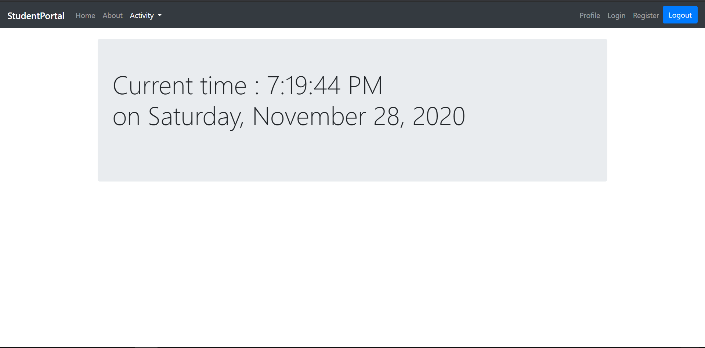
  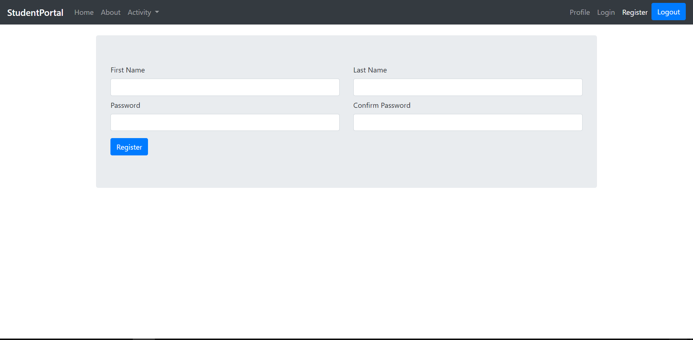
  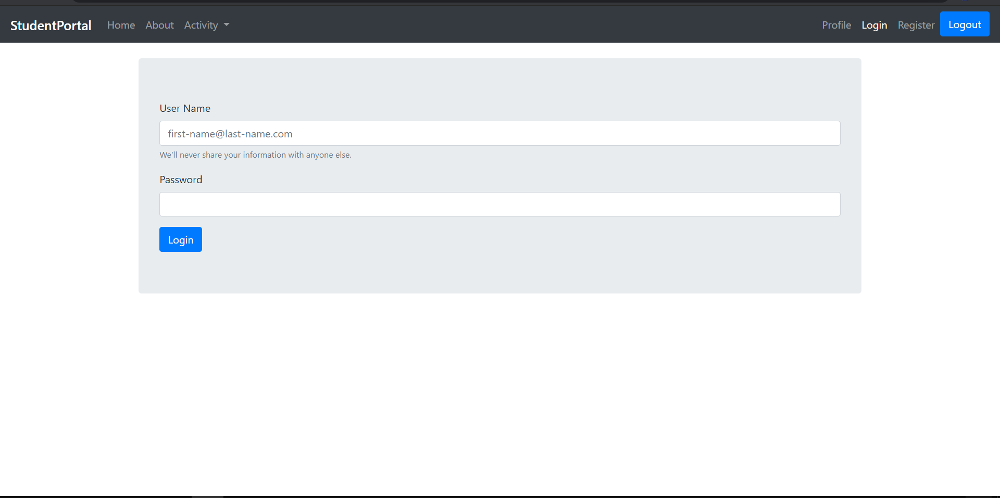
  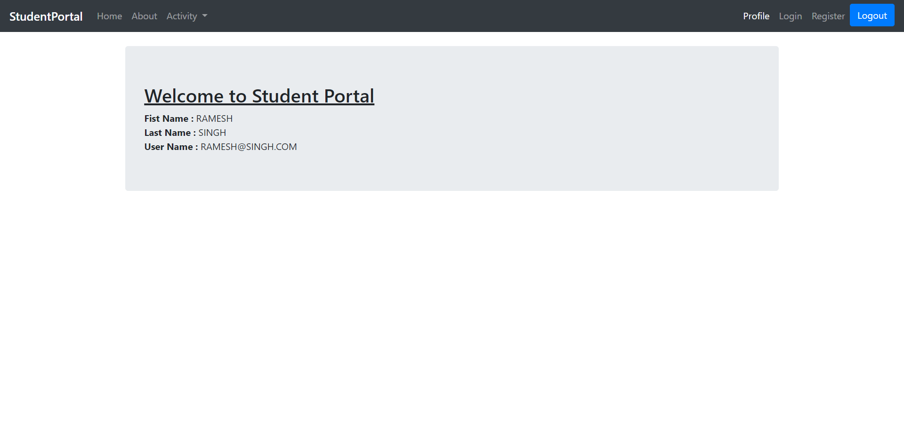
  
Setup

  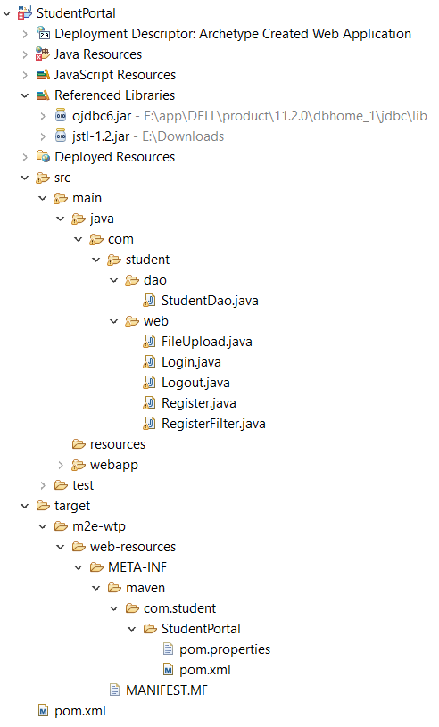

